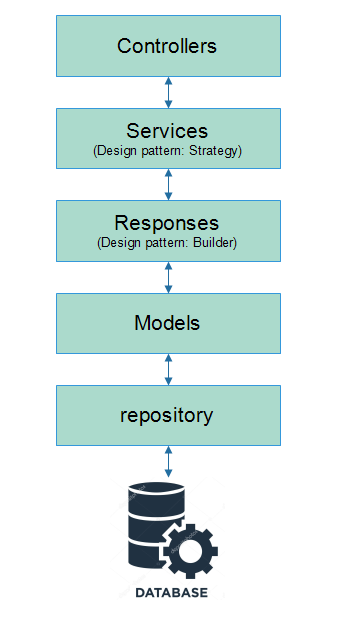
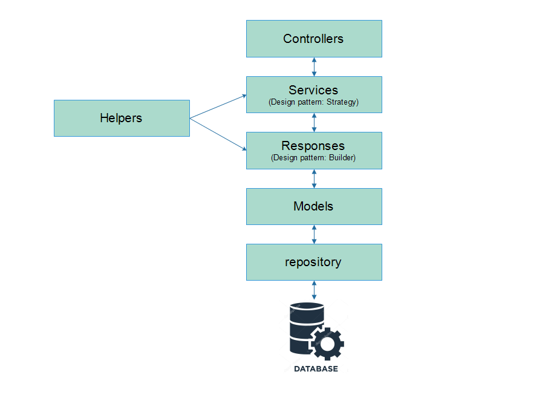
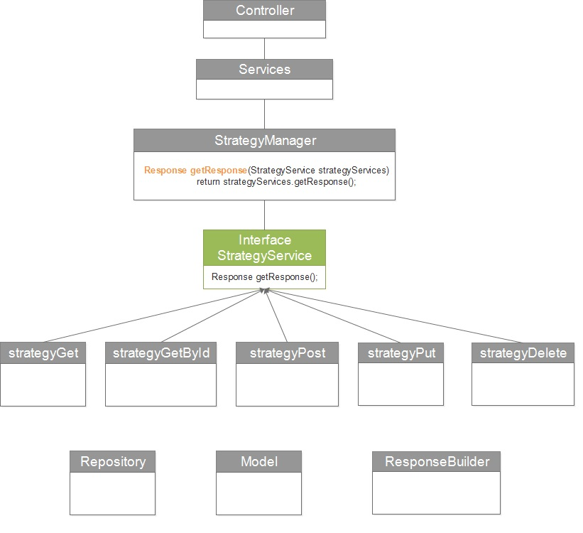
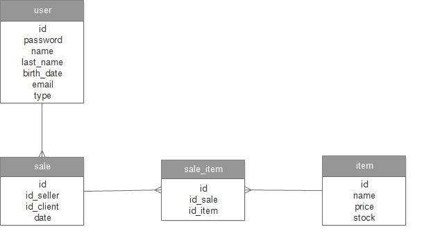

# java-spring-sales

This projet is using spring framework.

This project was performed using Java Spring framework with MySQL data bases, also this project is using Gradle for configurate dependencies, jacoco code coverage, check style, find bugs, Dependency injection, Strategy Design pattern and generics.

## Prerequisites 🚀

1. Install Windows 10 or Linux
2. Install Java 8.(1.8.0_201)
3. Install mysql:5.
4. Optional docker.

### Optional Deploy mysql db in docker

1. download docker mysql image:

```
docker pull mysql:5
```

2. start container:

```
docker run -d --name mysql -e MYSQL_ROOT_PASSWORD=secret123 -p 3306:3306 mysql:5
```

3. download docker phpmyadmin image:

```
docker pull phpmyadmin/phpmyadmin:4.8
```

4. start container:

```
docker run -d --name myadmin --link mysql:db -p 8080:80 phpmyadmin/phpmyadmin:4.8
container will start in:
http://10.31.35.100:8080/
root, secret123

```

## Installation 🔧

1. execute all sql from: sql/folder.
2. Configure with data bases credentials --- java-spring-sales/jar/version-001/application.properties
3. Windows - Start app with: java-spring-sales/jar/version-001/start.bat
4. Linux - Start app with: java-spring-sales/jar/version-001/start.sh

## Diagrams

### Diagram-architecture

<p align="center">
  
</p>

<p align="center">
  
</p>

### Diagram-class

<p align="center">
  
</p>

### Diagram-entity-relationship

<p align="center">
  
</p>

## USE

### USERS

```
GET USERS
{Host}:{Port}/api/v1/users
{Host}:{Port}/api/v1/users/{user_id}
localhost:8080/api/v1/users
localhost:8080/api/v1/users/5814525

POST USERS
{Host}:{Port}/api/v1/users
localhost:8080/api/v1/users
BODY:
{
    "id": "5814525",
    "password": "pass123",
    "name": "Sheldon",
    "lastName": "Cooper",
    "birthDate": "1994-05-26",
    "email": "Sheldon.Cooper@gmail.com",
    "type": "admin"
}

PUT USERS
{Host}:{Port}/api/v1/users/{user_id}
localhost:8080/api/v1/users/5814527
BODY:
{
    "id": "5814525",
    "password": "secret123",
    "name": "Sheldon",
    "lastName": "Cooper",
    "birthDate": "1994-05-26",
    "email": "Sheldon_Cooper@gmail.com",
    "type": "seller"
}

DELETE USERS
{Host}:{Port}/api/v1/users/{user_id}
localhost:8080/api/v1/users/5814527
```

### ITEMS

```
GET ITEMS
{Host}:{Port}/api/v1/items
{Host}:{Port}/api/v1/items/{item_id}
localhost:8080/api/v1/items
localhost:8080/api/v1/items/1001

POST ITEMS
{Host}:{Port}/api/v1/items
localhost:8080/api/v1/items
BODY:
{
    "name": "Drink RedBeer",
    "price": 35,
    "stock": 25
}

PUT ITEMS
{Host}:{Port}/api/v1/items/{item_id}
localhost:8080/api/v1/items/1001
BODY:
{
    "name": "Drink GreenBeer",
    "price": 25,
    "stock": 15
}

DELETE ITEMS
{Host}:{Port}/api/v1/items/{item_id}
localhost:8080/api/v1/items/1001
```

### SALES

```
GET SALES
{Host}:{Port}/api/v1/sales
{Host}:{Port}/api/v1/sales/{sale_id}
localhost:8080/api/v1/sales
localhost:8080/api/v1/sales/1001

POST SALES
{Host}:{Port}/api/v1/sales
localhost:8080/api/v1/sales
BODY:
{
    "idSeller": "9988555",
    "idClient": "7766776",
    "date": "2019-07-25"
}

PUT SALES
{Host}:{Port}/api/v1/sales/{sale_id}
localhost:8080/api/v1/sales/1001
BODY:
{
    "idSeller": "9988555",
    "idClient": "7766777",
    "date": "2019-07-25"
}

DELETE SALES
{Host}:{Port}/api/v1/sales/{sale_id}
localhost:8080/api/v1/sales/1001
```

### SALES ITEMS

```
GET SALES_ITEMS
{Host}:{Port}/api/v1/sales/items
{Host}:{Port}/api/v1/sales/items/{sale_item_id}
localhost:8080/api/v1/sales/items
localhost:8080/api/v1/sales/items/1001

POST SALES_ITEMS
{Host}:{Port}/api/v1/sales/items
localhost:8080/api/v1/sales/items
BODY:
{
    "idSale": 1001,
    "idItem": 1005,
    "quantity": 1
}

PUT SALES_ITEMS
{Host}:{Port}/api/v1/sales/items/{sale_item_id}
localhost:8080/api/v1/sales/items/1001
BODY:
{
    "idSale": 1010,
    "idItem": 1020,
    "quantity": 5
}

DELETE SALES_ITEMS
{Host}:{Port}/api/v1/sales/items/{sale_item_id}
localhost:8080/api/v1/sales/items/1001
```

## Contributing 🖇️

1. Fork it!
2. Create your feature branch: `git checkout -b issue/1001`
3. Commit your changes: `git commit -m 'issue/1001: Add some feature'`
4. Push to the branch: `git push origin issue/1001`
5. Submit a pull request.

## License 📄

- Copyright (c) 2019 by Richard Severich, Inc. All Rights Reserved.
- This software is the confidential and proprietary information of
- Richard Severich, Inc. ("Confidential Information").
- You may not disclose such Confidential Information, and may only
- use such Confidential Information in accordance with the terms of
- the license agreement you entered into with Richard Severich.
